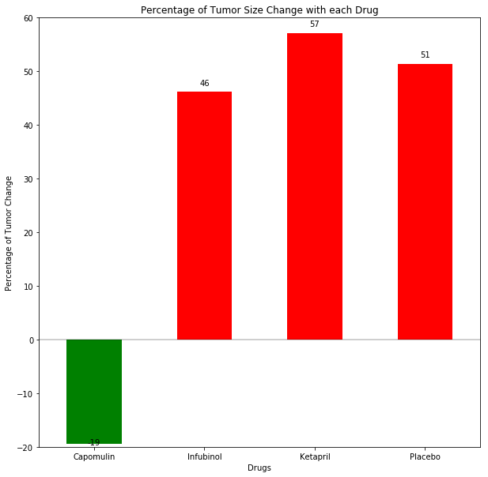

From the analysis of the data we can conclude that the drup Capomulin shows very promising result.
The tumor size with time has reduced with Capomulin. Metasti sites though they have increased is less compared to the other drugs with very low error margin. Survival rate for the Capomulin is also better than others. All the other three drugs show significant Tumor size increase with time. Infubinol has lower growth rate but suvival rate is the lowest.

```python
#Dependencies
import matplotlib.pyplot as plt
import numpy as np
import pandas as pd
import os
from scipy import stats
```


```python
## Input from user on the file anf path for the clinical data
input_path_clinical  = input("Enter the clinical filename with the path ")

```

    Enter the clinical filename with the path raw_data/clinicaltrial_data.csv
    


```python
## Input from user on the file anf path for the mice data
input_path_mice = input("Enter the Mice data filename with the path ")
```

    Enter the Mice data filename with the path raw_data/mouse_drug_data.csv
    


```python
## Reading the csv files into Dataframe
clinical_df = pd.read_csv(input_path_clinical)
mice_df= pd.read_csv(input_path_mice)
```


```python
##Eliminate the other treatments from the mice_df
mice_df= mice_df.loc[mice_df["Drug"].isin(["Capomulin", "Infubinol", "Ketapril","Placebo"])]
```


```python
## Merging Mice data with clinical data
clinical_df = clinical_df.merge(mice_df,on = "Mouse ID")
##clinical_df.loc[clinical_df["Mouse ID"] == "w914"]

```


```python
time_points = [0,5, 10, 15, 20, 25, 30, 35, 40, 45]

# Drug Options
drug_names = ["Capomulin", "Infubinol", "Ketapril","Placebo"]

# Tumor Volume Range
tumor_volume_range = (45, 400)

# Metastatic Range
met_range = (0, 5)

# Tumor Volume Change (Change and Liklihood)
cure_rates = [((-0.15, -0.01), 45), ((0.01, 0.02), 55)]
fail_rates = [((0.01, 0.05), 65), ((0.05, 0.10), 35)]

# Met Change (Change and Liklihood)
cure_met_rates = [(0, 85), (1, 15)]
fail_met_rates = [(0, 70), (1, 30)] 

# Mortality Rate
low_death_rates = [("Death", 4), ("Live", 96)]
high_death_rates = [("Death", 9), ("Live", 91)]
```


```python
## grouping by Drug and timepoints 
mice_drug_group = clinical_df.groupby(by = ["Drug","Timepoint"])

## collecting the errorbar for Tumor Vol
std_errors = mice_drug_group.sem()
std_err_capo_tumor=std_errors.loc["Capomulin","Tumor Volume (mm3)"]
std_err_keta_tumor=std_errors.loc["Ketapril","Tumor Volume (mm3)"]
std_err_infu_tumor=std_errors.loc["Infubinol","Tumor Volume (mm3)"]
std_err_place_tumor=std_errors.loc["Placebo","Tumor Volume (mm3)"]
## collecting errobar for Metastatic sites
std_err_capo_meta=std_errors.loc["Capomulin","Metastatic Sites"]
std_err_keta_meta=std_errors.loc["Ketapril","Metastatic Sites"]
std_err_infu_meta=std_errors.loc["Infubinol","Metastatic Sites"]
std_err_place_meta=std_errors.loc["Placebo","Metastatic Sites"]

```


```python
## colecting mean of Tumor Vol
mice_drug_mean = mice_drug_group["Tumor Volume (mm3)"].mean()
mice_drug_mean_df = pd.DataFrame(mice_drug_mean)
mice_drug_mean_df = mice_drug_mean_df.reset_index()

##collecting the average tumor size at different timepoint in a series
capo_tumor_vol = mice_drug_mean_df.loc[mice_drug_mean_df["Drug"]=="Capomulin","Tumor Volume (mm3)"]

infu_tumor_vol = mice_drug_mean_df.loc[mice_drug_mean_df["Drug"]=="Infubinol","Tumor Volume (mm3)"]
keta_tumor_vol = mice_drug_mean_df.loc[mice_drug_mean_df["Drug"]=="Ketapril","Tumor Volume (mm3)"]
place_tumor_vol = mice_drug_mean_df.loc[mice_drug_mean_df["Drug"]=="Placebo","Tumor Volume (mm3)"]
```


```python
## Plotting the average tumor volume along timepoints per drug

plt.figure(figsize=(12,8))
capo= plt.scatter(time_points,capo_tumor_vol,marker="o", facecolors="red",
            s=capo_tumor_vol, alpha=0.25,label = "Capomulin")
plt.errorbar(time_points, capo_tumor_vol, std_err_capo_tumor, fmt='o',color = 'red')

infu= plt.scatter(time_points,infu_tumor_vol,marker="o", facecolors="blue",
            s=infu_tumor_vol, alpha=0.25,label = "Infubinol")
plt.errorbar(time_points, infu_tumor_vol, std_err_infu_tumor, fmt='o',color = 'blue')

keta= plt.scatter(time_points,keta_tumor_vol,marker="o", facecolors="green",
            s=keta_tumor_vol, alpha=0.25,label= "Ketapril")
plt.errorbar(time_points, keta_tumor_vol, std_err_keta_tumor, fmt='o',color = 'green')


place= plt.scatter(time_points,place_tumor_vol,marker="o", facecolors="orange",
            s=place_tumor_vol, alpha=0.25,label = "Placebo")
plt.errorbar(time_points, place_tumor_vol, std_err_place_tumor, fmt='o',color = 'orange')

plt.legend(handles=[capo,infu,keta,place],loc='best')
plt.yticks(np.arange(min(capo_tumor_vol)-1, max(keta_tumor_vol)+1, 1.0))
plt.xlabel("Time point")
plt.ylabel("Average Tumore Volume in mm3")
plt.title("Tumor Volume change with Time for each drug")
plt.xlim(-0.5,48)
plt.ylim(min(capo_tumor_vol)-2,max(keta_tumor_vol)+2)
plt.show()

```


```python
## grouping by Drug and timepoints and taking the average metastatic at each timepoint
mice_drug_meta_mean = mice_drug_group["Metastatic Sites"].mean()
mice_drug_meta_mean_df = pd.DataFrame(mice_drug_meta_mean)
mice_drug_meta_mean_df = mice_drug_meta_mean_df.reset_index()
##collecting the metastic sites at different timepoint in a series
capo_meta_site = mice_drug_meta_mean_df.loc[mice_drug_mean_df["Drug"]=="Capomulin","Metastatic Sites"]
infu_meta_site = mice_drug_meta_mean_df.loc[mice_drug_mean_df["Drug"]=="Infubinol","Metastatic Sites"]
keta_meta_site = mice_drug_meta_mean_df.loc[mice_drug_mean_df["Drug"]=="Ketapril","Metastatic Sites"]
place_meta_site = mice_drug_meta_mean_df.loc[mice_drug_mean_df["Drug"]=="Placebo","Metastatic Sites"]
```


```python
## Plotting the average metastatic sites along timepoints per drug

plt.figure(figsize=(12,8))
capo_meta= plt.scatter(time_points,capo_meta_site,marker="o", facecolors="red",
            s=capo_tumor_vol, alpha=0.75,label = "Capomulin")
plt.errorbar(time_points, capo_meta_site, std_err_capo_meta, fmt='o',color = 'red')

infu_meta= plt.scatter(time_points,infu_meta_site,marker="o", facecolors="blue",
            s=infu_tumor_vol, alpha=0.75,label = "Infubinol")
plt.errorbar(time_points, infu_meta_site, std_err_infu_meta, fmt='o',color = 'blue')

keta_meta= plt.scatter(time_points,keta_meta_site,marker="o", facecolors="green",
            s=keta_tumor_vol, alpha=0.75,label= "Ketapril")
plt.errorbar(time_points, keta_meta_site, std_err_keta_meta, fmt='o',color = 'green')

place_meta= plt.scatter(time_points,place_meta_site,marker="o", facecolors="orange",
            s=place_tumor_vol, alpha=0.75,label = "Placebo")
plt.errorbar(time_points, place_meta_site, std_err_place_meta, fmt='o',color = 'orange')

##plt.yticks(np.arange(min(place_meta_site)-1, max(keta_meta_site)+1, 1.0))
plt.legend(handles=[capo_meta,infu_meta,keta_meta,place_meta],loc='best')
plt.xlabel("Time point")
plt.ylabel("Average Metastic Site")
plt.title("Metastic Site change with Time for each drug")
plt.xlim(-0.5,48)
plt.ylim(min(place_meta_site)-.5, max(keta_meta_site)+.5)
plt.show()

```


```python
##Countign the mice survived at each time point by counting the mice alive at each time
mice_survival = mice_drug_group["Mouse ID"].count()
mice_survival_df = pd.DataFrame(mice_survival)
mice_survival_df = mice_survival_df.reset_index()
##collecting the mice counts at different timepoint in a series
capo_mice_surv = mice_survival_df.loc[mice_survival_df["Drug"]=="Capomulin","Mouse ID"]
infu_mice_surv = mice_survival_df.loc[mice_survival_df["Drug"]=="Infubinol","Mouse ID"]
keta_mice_surv = mice_survival_df.loc[mice_survival_df["Drug"]=="Ketapril","Mouse ID"]
place_mice_surv = mice_survival_df.loc[mice_survival_df["Drug"]=="Placebo","Mouse ID"]
```


```python
## Plotting the survival rate along timepoints per drug
capo_survival= plt.scatter(time_points,capo_mice_surv,marker="o", facecolors="red",
            s=capo_tumor_vol, alpha=0.75,label = "Capomulin")

infu_survival= plt.scatter(time_points,infu_mice_surv,marker="o", facecolors="blue",
            s=infu_tumor_vol, alpha=0.75,label = "Infubinol")

keta_survival= plt.scatter(time_points,keta_mice_surv,marker="o", facecolors="green",
            s=keta_tumor_vol, alpha=0.75,label= "Ketapril")

place_survival= plt.scatter(time_points,place_mice_surv,marker="o", facecolors="orange",
            s=place_tumor_vol, alpha=0.75,label = "Placebo")

plt.legend(handles=[capo_survival,infu_survival,keta_survival,place_survival],loc='best')
plt.xlabel("Time point")
plt.ylabel("Survival Rate")
plt.title("Survival Rate with Time for each drug")
plt.xlim(-.25,46)
plt.ylim(5,27)
plt.show()
```


```python
## defining a list to store th change of tumor size
percent_tumor_change = []
##storing the change in tumor size
percent_tumor_change.append((mice_drug_mean_df.iloc[9,2] - mice_drug_mean_df.iloc[0,2])/mice_drug_mean_df.iloc[0,2]*100)
percent_tumor_change.append((mice_drug_mean_df.iloc[19,2] - mice_drug_mean_df.iloc[10,2])/mice_drug_mean_df.iloc[10,2]*100)
percent_tumor_change.append((mice_drug_mean_df.iloc[29,2] - mice_drug_mean_df.iloc[20,2])/mice_drug_mean_df.iloc[20,2]*100)
percent_tumor_change.append((mice_drug_mean_df.iloc[39,2] - mice_drug_mean_df.iloc[0,2])/mice_drug_mean_df.iloc[30,2]*100)

percent_tumor_change_df = pd.DataFrame({"Drug":drug_names,
                          "Tumor Change Percent":percent_tumor_change})


```


```python
## Creating a Bar graph for the Tumor change percent against each drug
fig,ax= plt.subplots(figsize=(10, 10))

result = ax.bar(drug_names,percent_tumor_change,width = 0.5,align='center',color="red")

mask1 = percent_tumor_change_df["Tumor Change Percent"] < 0

ax.hlines(0, -5, 10, alpha=0.25)
plt.xlim(-.5, 3.5)
plt.ylim(-20, 60)
plt.title("Percentage of Tumor Size Change with each Drug")
plt.xlabel("Drugs")
plt.ylabel("Percentage of Tumor Change")

ax.bar(percent_tumor_change_df["Drug"][mask1],percent_tumor_change_df["Tumor Change Percent"][mask1],width = 0.5,color = 'green')
def autolabel(rects):
    # attach some text labels
    for rect in rects:
        height = rect.get_height()
        ax.text(rect.get_x()+rect.get_width()/2.,1.02*height,
                '%d' % int(height),
                ha='center', va='bottom')


autolabel(result)

plt.show()
```




